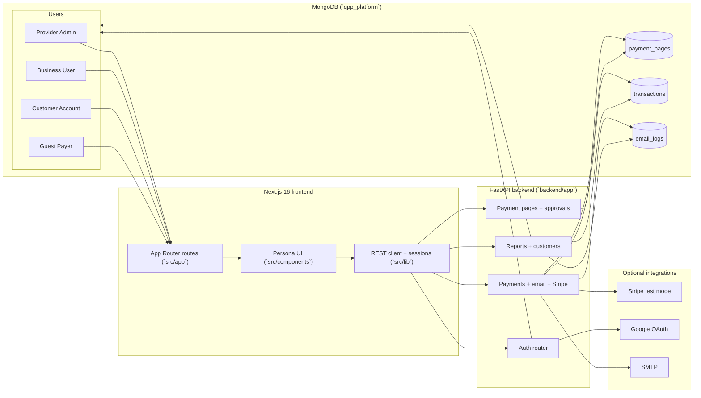

# Quick Payment Pages (Waystar Hackathon)

Quick Payment Pages (QPP) is a full-stack payment-page platform built for the Waystar QPP Hackathon challenge described in `QPP_Hackathon_Guide.pdf` and `QPP_Hackathon_Guide v2 Copy.docx`. It gives provider admins and business users a self-service portal to configure branded, reusable payment pages, distribute them via direct URL / iframe / QR, accept sandbox card / wallet / ACH payments, and review transaction and email activity from a reporting workspace.

This implementation uses Next.js 16 App Router + React 19 on the frontend, FastAPI on the backend, MongoDB for persistence, and optional Stripe / Google OAuth / SMTP integrations. A deeper code-level architecture document with multiple diagrams lives in [`docs/architecture.md`](docs/architecture.md).

## What This Repo Delivers

- Admin portal for platform-wide page management, approvals, reporting, and email-log visibility
- Business portal scoped to a single `business_id`
- Public hosted payment pages with branded presentation, custom fields, coupons, and sandbox checkout
- Optional customer accounts with saved payer profile, linked payment history, and Quick RePay memory
- Link distribution through direct URL, embeddable iframe snippet, and downloadable QR codes
- Reporting with filters, GL breakdown, payment-method mix, recent confirmation logs, and CSV export
- Seeded demo data for two businesses, two payment pages, multiple coupons, and completed transactions

## Architecture Overview



## Personas And Major Flows

| Persona | Entry routes | What they can do | Main code |
| --- | --- | --- | --- |
| Provider Admin | `/login`, `/admin`, `/admin/approvals`, `/admin/reports` | Create and edit any page, approve business submissions, see all reports and email logs | `src/components/admin/*`, `src/app/admin/*`, `backend/app/routers/payment_pages.py`, `backend/app/routers/reports.py` |
| Business User | `/business/login`, `/business`, `/business/pages/*`, `/business/reports` | Manage only their business pages and reports, submit pages for admin approval | `src/app/business/*`, `src/components/admin/*`, `backend/app/routers/payment_pages.py` |
| Customer | `/customer/login`, `/customer/register`, `/customer` | Save payer profile, review linked payment history, jump into public payment pages faster | `src/components/customer/*`, `backend/app/routers/customers.py`, `backend/app/routers/auth.py` |
| Public Payer | `/pay/[slug]`, `/pay/[slug]/success` | Use the hosted payment page without logging in, submit card / wallet / ACH payments, receive receipt | `src/components/payment/*`, `backend/app/routers/payments.py`, `backend/app/emailer.py` |

## Codebase Map

| Area | Key files | Responsibility |
| --- | --- | --- |
| Frontend routes | `src/app/layout.tsx`, `src/app/page.tsx`, `src/app/admin/*`, `src/app/business/*`, `src/app/customer/*`, `src/app/pay/[slug]/*` | App Router entrypoints and layout composition |
| Admin and business UI | `src/components/admin/admin-shell.tsx`, `admin-dashboard.tsx`, `page-builder.tsx`, `approval-dashboard.tsx`, `reporting-dashboard.tsx`, `share-tools.tsx` | Authenticated workspace, page builder, approvals, reports, share/distribution tooling |
| Public checkout UI | `src/components/payment/public-payment-page.tsx`, `payment-success-view.tsx` | Hosted payment experience, payment method handling, receipt view |
| Customer/auth UI | `src/components/customer/*`, `src/components/auth/*` | Customer registration/login, Google callback, profile, dashboard |
| Shared client logic | `src/lib/api.ts`, `types.ts`, `validation.ts`, `format.ts`, `use-admin-session.ts`, `use-customer-session.ts` | REST client, type contracts, client validation, session guards |
| Backend bootstrap | `backend/app/main.py`, `config.py`, `database.py` | App startup, settings, Mongo connection, indexes, CORS |
| Backend routers | `backend/app/routers/auth.py`, `customers.py`, `payment_pages.py`, `payments.py`, `reports.py` | Domain APIs split by responsibility |
| Backend services | `backend/app/security.py`, `serializers.py`, `utils.py`, `emailer.py` | JWT auth, serialization, helpers, email delivery |
| Seed/dev tooling | `backend/seed.py`, `scripts/start-mongo.sh`, `scripts/dev-stack.sh`, `docker-compose.yml` | Demo data, local startup, optional Mongo container |

## Hackathon Requirement Coverage

The table below maps the repo to the Waystar QPP brief. Status values are intentionally conservative so the README does not overclaim beyond the current code.

| Brief section | Status | Where it is implemented | Notes |
| --- | --- | --- | --- |
| `2.1.1 Create & Manage Payment Pages` | Complete | `src/components/admin/page-builder.tsx`, `backend/app/routers/payment_pages.py` | Create, edit, activate/deactivate, list pages, unique slug enforcement |
| `2.1.2 Branding & Styling` | Complete | `page-builder.tsx`, `public-payment-page.tsx` | Logo, brand color, titles, subtitle, header/footer, support email, live preview |
| `2.1.3 Payment Amount Configuration` | Complete | `backend/app/schemas.py`, `page-builder.tsx`, `public-payment-page.tsx`, `payments.py` | Fixed, range, and open amount modes are validated on both client and server |
| `2.1.4 Custom Data Fields` | Complete | `backend/app/schemas.py`, `payment_pages.py`, `page-builder.tsx`, `public-payment-page.tsx` | Up to 10 fields, typed inputs, required flags, options, helper text, ordering |
| `2.1.5 General Ledger (GL) Codes` | Complete | `schemas.py`, `payment_pages.py`, `reports.py` | GL codes are required, validated, stored on pages, and snapshotted into transactions |
| `2.1.6 Email Confirmation Templates` | Complete | `page-builder.tsx`, `payments.py`, `emailer.py`, `email_logs` | Per-page templates, variable substitution, default fallback template, logged delivery status |
| `2.2.1 Direct URL` | Complete | `backend/app/serializers.py`, `share-tools.tsx` | Human-readable `/pay/[slug]` URLs are generated and copyable |
| `2.2.2 Embeddable Iframe` | Complete | `backend/app/serializers.py`, `share-tools.tsx` | Iframe snippet generated from `public_url` and copyable in portal |
| `2.2.3 QR Code` | Complete | `src/components/admin/share-tools.tsx` | QR preview plus PNG/SVG download |
| `2.3 Payment Methods` | Complete for sandbox; optional live Stripe support | `public-payment-page.tsx`, `payments.py`, `schemas.py` | Card, wallet, and ACH all run in sandbox. Stripe PaymentIntent + webhook hooks exist when keys are configured |
| `2.4 Accessibility (WCAG)` | Mostly implemented, audit still needed | `public-payment-page.tsx`, `globals.css` | Labels, `aria-invalid`, `aria-describedby`, keyboard-friendly controls, focus styling. No committed Lighthouse/axe report in repo |
| `2.5 Reporting` | Complete | `reporting-dashboard.tsx`, `reports.py` | Filters, summaries, GL breakdown, method mix, recent email logs, CSV export |
| `2.6 Product Differentiator` | Complete | `public-payment-page.tsx`, `src/lib/api.ts`, `customer-dashboard.tsx` | "Quick RePay" remembers payer details per page and optionally links transactions to a customer account |
| `3.1 Application Architecture` | Complete at repo level | `src/app/*`, `backend/app/*`, `backend/seed.py` | Hosted full-stack architecture, REST API, documented schema, JWT auth, Mongo persistence |
| `3.3 Security Requirements` | Mostly complete | `config.py`, `security.py`, `schemas.py`, `validation.ts` | Env-driven secrets, JWT auth, input validation, sandbox/test processing. HTTPS depends on deployment target |
| `4 Deliverables` | Mostly complete in repo | `README.md`, `docs/architecture.md`, `backend/seed.py` | Source, setup, architecture, schema, demo pages, and test transactions are present. Hosted URL is deployment work, not repo code |

## Judging Alignment

| Judging dimension | How this repo supports it | Current caveat |
| --- | --- | --- |
| Functionality & Completeness | Broad coverage across admin config, public payments, reporting, distribution, customer accounts, approvals | Public hosting is not part of the local repo by itself |
| User Experience & Design | Custom visual system, branded page builder preview, polished share tools, receipt view, optional customer acceleration | Accessibility testing evidence is not checked in |
| Accessibility | Form labels, field-level error messaging, focus styles, semantic controls, keyboard-friendly interactions | A formal Lighthouse or axe audit should still be run before demo day |
| Code Quality & Architecture | Clear split between frontend modules, REST client, FastAPI routers, shared utilities, and Mongo persistence | No automated test suite is committed right now |
| Demo & Communication | Seeded accounts, seeded pages, seeded transactions, CSV export, receipt/email logs, architecture diagrams | Judges still need a hosted URL and credentials when deployed |

## Runtime Behaviors Worth Knowing

- Portal and customer JWT sessions are stored in `sessionStorage` via `src/lib/api.ts`.
- Quick RePay memory is stored in `localStorage` under the `qpp-payer-memory:<slug>` key.
- Portal protection happens in `usePortalSession`, which calls `/auth/me` to verify both the token and the expected role.
- Customer protection happens in `useCustomerSession`, which calls `/auth/me` in customer mode.
- Email receipts always create an `email_logs` record. Without SMTP configuration, delivery mode is `preview`, so the demo still shows end-to-end behavior.
- Stripe is optional. If Stripe keys are missing or Stripe calls fail, the payment router falls back to internal sandbox behavior so card, wallet, and ACH demos still work locally.
- Google OAuth is optional. When enabled, new Google sign-ins auto-create a `CUSTOMER` user if the email does not already exist.

## Route Inventory

### Public

- `/`
- `/pay/[slug]`
- `/pay/[slug]/success`
- `/auth/callback/google`

### Admin

- `/login`
- `/admin`
- `/admin/pages/new`
- `/admin/pages/[pageId]`
- `/admin/approvals`
- `/admin/reports`

### Business

- `/business/login`
- `/business`
- `/business/pages/new`
- `/business/pages/[pageId]`
- `/business/reports`

### Customer

- `/customer/login`
- `/customer/register`
- `/customer`

## API Inventory

| Domain | Endpoints | Backing file |
| --- | --- | --- |
| Auth | `POST /api/v1/auth/login`, `POST /api/v1/auth/customer/register`, `GET /api/v1/auth/me`, `POST /api/v1/auth/oauth/google` | `backend/app/routers/auth.py` |
| Customers | `GET /api/v1/customers/me/dashboard`, `PUT /api/v1/customers/me/profile` | `backend/app/routers/customers.py` |
| Payment pages | `GET /api/v1/payment-pages`, `POST /api/v1/payment-pages`, `GET /api/v1/payment-pages/{page_id}`, `PUT /api/v1/payment-pages/{page_id}`, `GET /api/v1/payment-pages-approvals`, `POST /api/v1/payment-pages/{page_id}/approval`, `GET /api/v1/public/payment-pages/{slug}`, `GET /api/v1/public/payment-pages` | `backend/app/routers/payment_pages.py` |
| Payments | `POST /api/v1/public/payment-pages/{slug}/payments`, `POST /api/v1/public/payment-pages/{slug}/stripe/intent`, `GET /api/v1/public/transactions/{public_id}`, `POST /api/v1/public/stripe/webhook` | `backend/app/routers/payments.py` |
| Reporting | `GET /api/v1/reports/transactions`, `GET /api/v1/reports/summary`, `GET /api/v1/reports/email-logs`, `GET /api/v1/reports/export.csv` | `backend/app/routers/reports.py` |

## Data Model And Collections

MongoDB indexes are created on startup in `backend/app/database.py`.

| Collection | Key fields | Purpose |
| --- | --- | --- |
| `users` | `email`, `role`, `business_id`, `business_name`, `saved_profile`, `google_id` | Shared auth collection for `ADMIN`, `BUSINESS`, and `CUSTOMER` users |
| `payment_pages` | `slug`, `business_id`, `organization_name`, `brand_color`, `amount_mode`, `custom_fields`, `gl_codes`, `coupon_codes`, `approval_status`, `is_active` | Source of truth for branded page configuration and approval state |
| `transactions` | `public_id`, `page_id`, `customer_id`, `amount_cents`, `original_amount_cents`, `discount_amount_cents`, `payment_method`, `status`, `gl_codes_snapshot`, `field_responses`, `processor_reference` | Immutable-ish payment records and reporting source |
| `email_logs` | `page_id`, `business_id`, `transaction_id`, `to_email`, `subject`, `delivery_mode`, `status` | Receipt delivery tracking and demo visibility |

## Local Setup

### Prerequisites

- Node.js 20+
- Python 3.12
- `uv`
- MongoDB locally or Docker Desktop

### 1. Install dependencies

Frontend:

```bash
npm install
```

Backend:

```bash
cd backend
uv venv --python 3.12 .venv
uv pip install --python .venv/bin/python -r requirements.txt
cd ..
```

### 2. Create frontend env

Create `.env.local` in the repo root:

```env
NEXT_PUBLIC_API_BASE_URL="http://localhost:8000/api/v1"
NEXT_PUBLIC_STRIPE_PUBLISHABLE_KEY=""
NEXT_PUBLIC_GOOGLE_CLIENT_ID=""
```

### 3. Create backend env

Create `backend/.env`:

```env
MONGODB_URI="mongodb://localhost:27017"
MONGODB_DB_NAME="qpp_platform"
JWT_SECRET="replace-with-a-long-random-secret"
FRONTEND_APP_URL="http://localhost:3000"
ALLOWED_ORIGINS="http://localhost:3000,http://127.0.0.1:3000"

DEMO_ADMIN_EMAIL="admin@example.com"
DEMO_ADMIN_PASSWORD="ChangeMe123!"

SMTP_HOST=""
SMTP_PORT="587"
SMTP_SECURE="false"
SMTP_USER=""
SMTP_PASS=""
SMTP_FROM_EMAIL="Quick Payment Pages <no-reply@quickpay.local>"

GOOGLE_CLIENT_ID=""
GOOGLE_CLIENT_SECRET=""

STRIPE_SECRET_KEY=""
STRIPE_CURRENCY="usd"
STRIPE_WEBHOOK_SECRET=""
```

### 4. Start MongoDB

Use the helper script:

```bash
npm run mongo:start
```

Or Docker directly:

```bash
docker compose up -d mongo
```

### 5. Seed the database

```bash
npm run backend:seed
```

### 6. Start the full stack

```bash
npm run dev:all
```

That script:

- starts MongoDB if needed
- starts FastAPI on `http://127.0.0.1:8000`
- starts Next.js on `http://127.0.0.1:3000`

### 7. Useful manual commands

```bash
npm run dev
npm run backend:dev
npm run lint
```

## Seeded Demo Data

### Accounts

| Role | Email | Password |
| --- | --- | --- |
| Admin | `admin@example.com` | `ChangeMe123!` |
| Business 1 | `owner@solsticeyoga.example` | `ChangeMe123!` |
| Business 2 | `billing@maplecityutilities.example` | `ChangeMe123!` |
| Customer | `customer@example.com` | `ChangeMe123!` |

### Pages

- `/pay/yoga-class`
- `/pay/city-utilities`

### Coupons

- `SAVE10`
- `NEWYOGA`
- `GREEN5`

### Seeded transactions

- A successful yoga card payment with coupon discount
- A pending utility ACH payment

## Suggested Demo Script

1. Sign in as admin and show the page list, approval queue, and reporting cards.
2. Open an existing payment page in the builder and highlight branding, amount modes, custom fields, GL codes, coupons, email template, and live preview.
3. Show the share tools section with copyable URL, iframe snippet, and QR downloads.
4. Switch to a business account and show business-scoped visibility.
5. Open `/pay/yoga-class` and complete a sandbox card flow.
6. Show the success page, then open admin reports and recent email logs.
7. Optionally sign in as customer to demonstrate saved payer profile and linked payment history.

## Known Gaps And Deployment Notes

- This repo documents the architecture and includes local demo behavior, but it does not include a deployed HTTPS URL by itself.
- WCAG-minded patterns are present, but a formal Lighthouse or axe audit result is not committed.
- There is no automated end-to-end test suite in the repo today.
- SMTP delivery is optional. Without it, email logs still show preview-mode receipts.
- Google OAuth is optional and requires both frontend and backend Google client settings.
- Stripe integration is partially live-ready: PaymentIntent creation, confirmation, and webhook handling exist, but real test-mode behavior depends on valid Stripe credentials.

## Additional Documentation

- Detailed diagrams and a code-level architecture walkthrough: [`docs/architecture.md`](docs/architecture.md)
- Vercel deployment steps for frontend + backend: [`docs/vercel-deployment.md`](docs/vercel-deployment.md)
- Hackathon brief used as the documentation source of truth: `QPP_Hackathon_Guide.pdf`, `QPP_Hackathon_Guide v2 Copy.docx`
